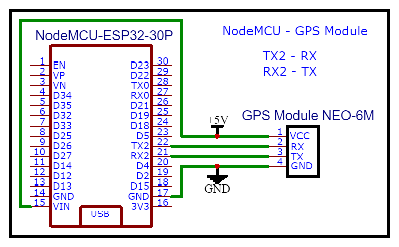

# WiFi Manager

## Table of Contents

1. [Overview](#overview)
2. [Pre-requisites](#pre-requisites)
   - [Components](#components)
   - [Circuit](#circuit)
   - [Library](#library)
3. [Variables and Functions](#variables-and-functions)
   - [Float Variables](#float-variables)
   - [Function to Initiate GPS Module](#function-to-initiate-gps-module)
   - [Function to Read Coordinates](#function-to-read-coordinates)
   - [Function to Display Readings](#function-to-display-readings)
4. [How to use](#how-to-use)
   - [Code](#code)
5. [Frequently Asked Questions](#frequently-asked-questions)
6. [Sample Full Code](#sample-full-code)

## Overview

This is a simple implementation of the [TinyGPS++ Arduino Library](https://github.com/mikalhart/TinyGPSPlus) with the GPS Module Neo6m and NodeMCU ESP32. The TinyGPS++ Library handles the parsing of [NMEA data](https://www.gpsworld.com/what-exactly-is-gps-nmea-data/). Even though the GPS module can provide data including time, date, latitude, longitude, altitude, and estimated velocity, this implementation is limited to returning only the coordinates of the GPS Module location (Longitude and Latitude).

## Pre-requisites

Lists the necessary components and libraries required for integrating WiFi Manager into your Arduino project, including setup diagrams and installation instructions for the Tzapu WiFi Manager library.

### Components

1. **NodeMCU ESP-32**

   

2. **U-blox Neo 6m GPS Module**

   

3. **Connecting Wires / Jumper Wires**

   

4. **Protoboard / Breadboard**

   
   

### Circuit

Connect the VCC and GND pins of the GPS Module to the VIN and GND pins of the NodeMCU ESP32, respectively. Then, connect RX2 and TX2 of the NodeMCU to the TX and RX pins of the GPS module, respectively. Refer to the circuit diagram provided below for detailed guidance.



### Library

1. [Install](https://github.com/wryte4me/install-arduino-library) the library [TinyGPS++ by Mikal Hart](https://github.com/mikalhart/TinyGPSPlus). Note: This implementation used version 0.0.2 of the library.

## Variables and Functions

### Float Variables

Declare `float` variables to store latitude and longitude.

```cpp
float latitude, longitude;
float defaultLatitude;
float defaultLongitude;
```

### Function to Initiate GPS Module

Function to initiate the GPS Module.

```cpp
void initGPS(TinyGPSPlus &_gps) {
  Serial2.begin(9600);                                    // Start Serial2 at 9600 baud rate for GPS communication
  if (millis() > 5000 && _gps.charsProcessed() < 10) {    // After 5 seconds, check if less than 10 characters are processed
    Serial.println(F("No GPS detected: check wiring."));  // Print error message if GPS is not detected
    while (true)
      ;  // Infinite loop to halt further execution
  } else {
    Serial.println("GPS Module Initialization success.");
  }
}
```

### Function to Read Coordinates

Function to read the coordinates from the GPS Module and store them in global variables. Returns `true` if the majority of readings are valid, otherwise returns `false`.

```cpp
bool readGPS(TinyGPSPlus &_gps, float &_locLatitude, float &_locLongitude) {
  const int maxReadings = 20;
  const unsigned long timeout = 500;  // 500 ms timeout
  int validReadings = 0;
  float sumLat = 0.0;
  float sumLng = 0.0;

  for (int i = 0; i < maxReadings; ++i) {
    unsigned long start = millis();
    while (millis() - start < timeout) {
      if (Serial2.available() > 0) {
        char c = Serial2.read();
        if (_gps.encode(c) && _gps.location.isValid()) {
          sumLat += _gps.location.lat();
          sumLng += _gps.location.lng();
          ++validReadings;
          Serial.print(validReadings);
          break;
        }
      }
    }
  }

  if (validReadings > 0) {
    _locLatitude = sumLat / validReadings;
    _locLongitude = sumLng / validReadings;
    Serial.print("Updating coordinates : ");
    Serial.print(_locLatitude);
    Serial.print(" , ");
    Serial.println(_locLongitude);
    return true;
  } else {
    _locLatitude = defaultLatitude;
    _locLongitude = defaultLongitude;
    Serial.println("Invalid Reading, Returning default loc");
    return false;
  }
}
```

### Function to Display Readings

Function to display the readings on the Serial Monitor.

```cpp
void displayGPS(float _latitude, float _longitude) {
  Serial.print("New Location: \t Latitude: "); 
  Serial.print(_latitude, 6);                   
  Serial.print(", Longitude: ");                
  Serial.println(_longitude, 6);                
}
```

## How to Use

### Code

Steps to include necessary library headers, create a WiFi Manager instance, and initialize the WiFi configuration struct with custom parameters.

1. **Include Library**

    ```cpp
    #include <TinyGPSPlus.h>
    ```

2. **Create an Instance of the Library**

    ```cpp
    TinyGPSPlus gps;
    ```

3. **Declare Global Variables to Store Latitude and Longitude of the Location**

    ```cpp
    float latitude, longitude;
    float defaultLatitude;
    float defaultLongitude;
    ```

4. **Call the `initGPS` Function Inside the `setup()`**

5. **Call the `readGPS` Function Inside the `loop()`**

   This will get the coordinates from the GPS module and store them in the variables you declared previously.

## Frequently Asked Questions

Common issues and troubleshooting tips.

## Sample Full Code

Complete Arduino sketch integrating the GPS module and NodeMCU ESP32.

```cpp
#include <TinyGPSPlus.h>

TinyGPSPlus gps;
float latitude, longitude;
float defaultLatitude = 0.0;
float defaultLongitude = 0.0;

void setup() {
  Serial.begin(115200);
  initGPS(gps);
}

void loop() {
  if (readGPS(gps, latitude, longitude)) {
    displayGPS(latitude, longitude);
  } else {
    displayGPS(defaultLatitude, defaultLongitude);
  }
}

void initGPS(TinyGPSPlus &_gps) {
  Serial2.begin(9600);                                    // Start Serial2 at 9600 baud rate for GPS communication
  if (millis() > 5000 && _gps.charsProcessed() < 10) {    // After 5 seconds, check if less than 10 characters are processed
    Serial.println(F("No GPS detected: check wiring."));  // Print error message if GPS is not detected
    while (true)
      ;  // Infinite loop to halt further execution
  } else {
    Serial.println("GPS Module Initialization success.");
  }
}

bool readGPS(TinyGPSPlus &_gps, float &_locLatitude, float &_locLongitude) {
  const int maxReadings = 20;
  const unsigned long timeout = 500;  // 500 ms timeout
  int validReadings = 0;
  float sumLat = 0.0;
  float sumLng = 0.0;

  for (int i = 0; i < maxReadings; ++i) {
    unsigned long start = millis();
    while (millis() - start < timeout) {
      if (Serial2.available() > 0) {
        char c = Serial2.read();
        if (_gps.encode(c) && _gps.location.isValid()) {
          sumLat += _gps.location.lat();
          sumLng += _gps.location.lng();
          ++validReadings;
          break;
        }
      }
    }
  }

  if (validReadings > 0) {
    _locLatitude = sumLat / validReadings;
    _locLongitude = sumLng / validReadings;
    return true;
  } else {
    _locLatitude = defaultLatitude;
    _locLongitude = defaultLongitude;
    return false;
  }
}

void displayGPS(float _latitude, float _longitude) {
  Serial.print("New Location: \t Latitude: "); 
  Serial.print(_latitude, 6);                   
  Serial.print(", Longitude: ");                
  Serial.println(_longitude, 6);                
}
```
